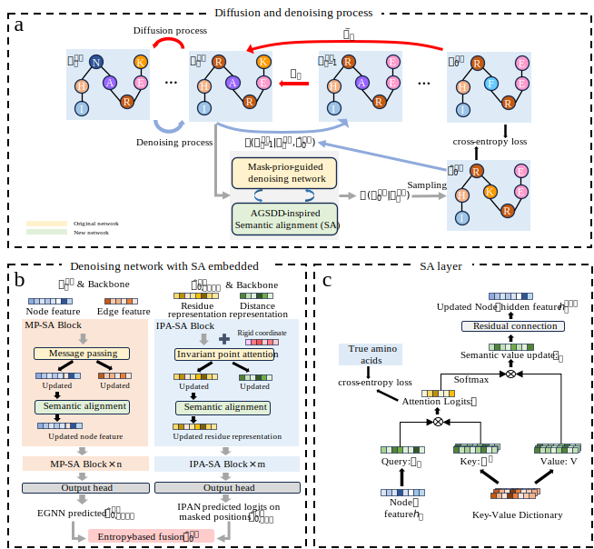

#  A geometry-corrected, AGSDD-inspired extension of MapDiff

<!-- <div align="center"> -->
<a href="https://pytorch.org/get-started/locally/"></a>
<a href="https://hydra.cc/"></a>
<a href="10.21203/rs.3.rs-10307155/v1"></a>
[](https://github.com/peizhenbai/MapDiff/blob/main/LICENSE)

<!-- </div> -->
## Introduction
This repository provides a PyTorch implementation of the AGSDD-inspired-MapDiff. [AGSDD](https://doi.org/10.1007/978-3-032-06066-2_21) suggested semantic alignment (SA) as a way to incorporate amino-acid-level semantic information into diffusion-based inverse folding. 
Inspired by SA, this repository examines the transferability of AGSDD-inspired SA to MapDiff as a case study. AGSDD-inspired-MapDiff is built on top of a dihedral-standardized [MapDiff](https://github.com/peizhenbai/MapDiff/) baseline, where the backbone dihedral feature calculation was standardized before adding semantic modules.

## Framework


## Local Environment Setup
AGSDD-inspired-MapDiff can be used on Linux, Windows and MacOS (OSX) with enough RAM. We recommend the environment setup via conda package manager. 
The required python dependencies are given below, which follows the original MapDiff environment.
```
# create a new conda environment
$ conda create --name agsdd-mapdiff python=3.8
$ conda activate agsdd-mapdiff

# install required python dependencies
$ conda install pytorch==1.13.1 pytorch-cuda=11.7 -c pytorch -c nvidia
$ conda install pyg==2.4.0 -c pyg
$ conda install -c ostrokach dssp
$ pip install --no-index torch-cluster torch-scatter -f https://pytorch-geometric.com/whl/torch-1.13.0+cu117.html
$ pip install rdkit==2023.3.3
$ pip install hydra-core==1.3.2
$ pip install biopython==1.81
$ pip install einops==0.7.0
$ pip install prettytable
$ pip install comet-ml

# clone the repository of AGSDD-inspired-MapDiff
$ git clone https://github.com/Zhangke123jimu/AGSDD-inspired-MapDiff.git
$ cd AGSDD-inspired-MapDiff
```

## Dataset
**Download the CATH datasets**
- CATH 4.2 dataset is sourced from [Generative Models for Graph-Based Protein Design](https://papers.nips.cc/paper/2019/hash/f3a4ff4839c56a5f460c88cce3666a2b-Abstract.html) [1].
- CATH 4.3 dataset is sourced from [Learning inverse folding from millions of predicted structures](https://proceedings.mlr.press/v162/hsu22a/hsu22a.pdf) [2].

To download the PDB files of CATH, run the following command. `${cath_version}` could be either `4.2` or `4.3`.
```
$ python data/download_cath.py --cath_version=${cath_version}
```
**Process data and construct residue graphs**

Put the downloaded data under the `./data` folder. Then, run the following command to process them. `${download_dir}` is the path to the downloaded data in the previous step.
`${num_workers}` is the number of parallel processes, where the default value is four.

```
$ python generate_graph_cath.py --download_dir=${download_dir} --num-workers=${num_workers}
```

## Model Training
We provide the configurations for model hyperparameters in `./conf` via [Hydra](https://github.com/facebookresearch/hydra). The training of AGSDD-MapDiff can be divided into the two stages: mask-prior IPA pre-training and denoising diffusion network training. 
You can directly run the following commands to re-run our training pipeline. `config-name` is the pre-defined yaml file in `./conf`. `${train_data}`, `${val_data}` and `${test_data}` are the paths to the processed data for training and evaluation.

When training on multiple GPUs, set `${num_GPUs}` to the number of available GPUs. To resume training from a checkpoint, set `${resume_path}` to the checkpoint path. Checkpoints are saved at the configured epoch interval.

**Mask-prior IPA pre-training**
```
# for a single GPU
$ python mask_ipa_pretrain.py --config-name=mask_pretrain comet.use=${use_comet} comet.workspace=${your_workspace} dataset.train_dir=${train_data} resume_path=${resume_path}

# for multiple GPUs
$ torchrun --standalone --nproc_per_node=${num_GPUs} mask_ipa_pretrain.py --config-name=mask_pretrain comet.use=${use_comet} comet.workspace=${your_workspace} dataset.train_dir=${train_data} resume_path=${resume_path}
```

**Denoising diffusion network training**
```
# for a single GPU
$ python main.py --config-name=diff_config prior_model.path=${ipa_model} dataset.train_dir=${train_data} dataset.val_dir=${val_data} dataset.test_dir=${test_data} resume_path=${resume_path}

# for multiple GPUs
$ torchrun --standalone --nproc_per_node=${num_GPUs} main.py --config-name=diff_config prior_model.path=${ipa_model} dataset.train_dir=${train_data} dataset.val_dir=${val_data} dataset.test_dir=${test_data} resume_path=${resume_path}
```

In particular, `${use_comet}` and `${your_workspace}` are optional to use [Comet ML](https://www.comet.com/site/). It is an online machine learning experimentation platform to track and monitor ML experiments. We provide Comet ML support to easily monitor training and evaluation process in our pipeline. Please follow the steps below to apply Comet ML.

- Sign up [Comet](https://www.comet.com/site/) account and install its package via `pip install comet_ml`. 
   
- Save your generated API key into `.comet.config` in your home directory, which can be found in your account setting. The saved file format is as follows:

```
[comet]
api_key=YOUR-API-KEY
```

- In `./conf/comet`, please set `comet.use` to `True` and change `comet.workspace` into the one that you created on Comet.

## Model Inference

We provide the inference code to predict amino acid sequences from arbitrary pdb structures using the trained weights. Please refer `model_inference.ipynb` for the detailed usage. You can download our model checkpoint (Semantic-alignment & Dihedral-fixed version) trained on CATH 4.2 from [here](https://github.com/Zhangke123jimu/AGSDD-inspired-MapDiff/releases/download/agsdd-inspired-mapdiff-v1.0.0/AGSDD-inspired-MapDiff_weights.pt) for the inference pipeline.
The model checkpoint for Dihedral-fixed version can also be downloaded [here](https://github.com/Zhangke123jimu/AGSDD-inspired-MapDiff/releases/download/agsdd-inspired-mapdiff-geofixonly-v1.0.0/AGSDD-inspired-MapDiff_geofixonly_weights.pt).


## Citation
If you find that this work is useful for your research, please consider give a star ⭐ and citation:
```
@article{zhang2026semantic,
  title={Investigating the Effect and Mechanism of Semantic Alignment in Fixed-Backbone Protein Sequence Design},
  author={Zhang, Ke},
  journal={Research Square},
  year={2026},
  doi={10.21203/rs.3.rs-10307155/v1}
}
```

## Acknowledgements and References
This implementation is inspired by the following open-source projects: [MapDiff](https://github.com/peizhenbai/MapDiff/), [AGSDD](https://github.com/llllly26/AGSDD/) and their corresponding publications [3-4]. 
Thanks for their contributions to the open-source community. 

Parts of the documentation and code review process were assisted by AI tools and manually reviewed by the repository maintainer.

    [3] Bai, P., Miljković, F., Liu, X. et al. Mask-prior-guided denoising diffusion improves inverse protein folding. Nat Mach Intell 7, 876–888 (2025).
    [4] Wang, C., Zhou, Y., Wang, Z., Zhai, Z., Shen, J., Zhang, K. (2026). Alternate Geometric and Semantic Denoising Diffusion for Protein Inverse Folding. In: Ribeiro, R.P., et al. Machine Learning and Knowledge Discovery in Databases. Research Track. ECML PKDD 2025. Lecture Notes in Computer Science, vol 16015. Springer, Cham.
